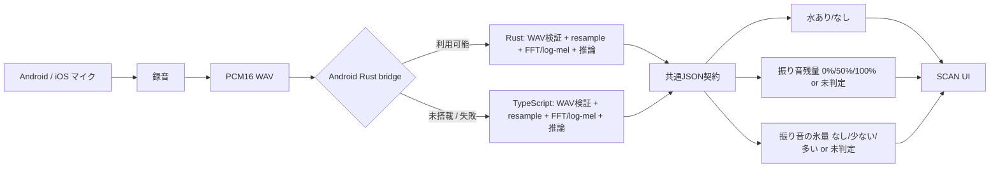
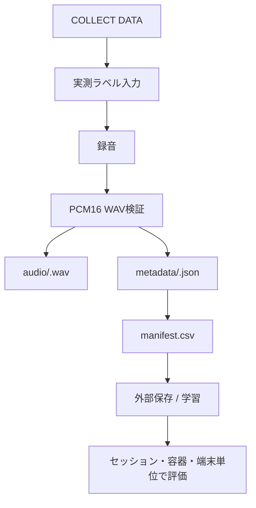

# ColdKeep 構成図

## 提出版の処理フロー



## データ収集フロー



## 境界と安全策

- UIはRust/TypeScriptのどちらの経路でも同じ戻り値契約を使う。
- Rust経路が落ちても、テスト済みのTypeScriptフォールバックで解析を継続する。
- 音声が短い、WAV形式が不正、権限がない、推論に失敗した場合は、古い結果を残さず `未判定` に戻す。
- 水判定と充填判定の低い方の確率が0.65未満なら、残量差分を飲水量へ自動変換しない。
- 振り音の氷量は学習済みモデルかつ信頼度0.65以上のときだけ `なし/少ない/多い` を表示し、それ以外は `null`（未判定）にする。正確な個数や重量は返さない。
- ACM-S2の注ぐ音ベースライン（50%/90%）は研究用の比較結果であり、振り音の残量推定や個人向け自動記録へ流用しない。

## アプリケーション構造

提出版は、React NativeのUIを外側に置き、機能単位のモジュラーモノリスと
軽量オニオン／ヘキサゴナル境界を採用する。

```text
src/features/scan/
  domain/       ScanResultと判定ポリシー
  application/  録音・推論のユースケースとフォールバック
src/features/collection/
  application/  ラベル付き録音とエクスポートのユースケース
src/platform/
  android/      Kotlin AudioRecordとAndroid権限のアダプター
  ml/            Rust / TypeScript推論アダプター
  storage/      react-native-fsアダプター
  sharing/      React Native Shareアダプター
src/app/
  compositionRoot.ts  PortとAdapterの組み立て
```

Domain/ApplicationはReact Native、Kotlin、Rust、RNFSを直接参照しない。
録音・推論・保存はPort経由で差し替えられるため、Rustの有無や将来のiOS実装が
UIの変更に波及しない。現在の`dataCollection.ts`、`audioProcessing.ts`、
`publicAudioClassifier.ts`は既存テストとの互換性を保つ共有モジュールとして残し、
新しい依存は`src/app/compositionRoot.ts`から注入する。
