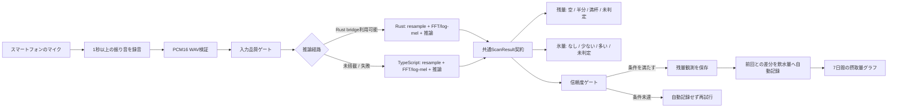
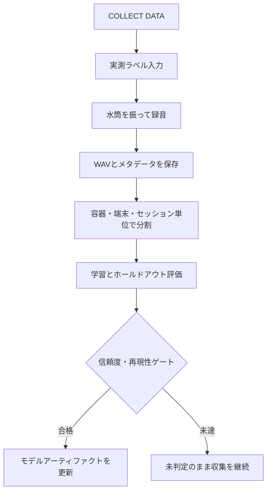

# ColdKeep VORN提出用 技術構成

## 1. 作品の処理フロー



## 2. データ収集と改善フロー



## 3. 機能単位のモジュラーモノリス + オニオン境界

```text
src/features/scan/
  domain/       ScanResult、判定クラス、信頼度ポリシー
  application/  録音停止、推論、結果変換のユースケース
src/features/hydration/
  domain/       容量、残量観測、飲水量差分のルール
  application/  自動記録と7日間集計のユースケース
src/features/collection/
  domain/       振り音ラベルとメタデータの契約
  application/  ラベル付き録音とデータエクスポート
src/platform/
  audio/        WAV、PCM、リサンプリング
  android/      Kotlin AudioRecordと権限アダプター
  ios/          iOS録音と権限アダプター
  ml/            Rust / TypeScript推論アダプター
  storage/      端末内保存アダプター
src/app/
  compositionRoot.ts  PortとAdapterの組み立て
```

Domain/Application層はReact Native、Kotlin、Rust、RNFSのAPIを直接参照しません。録音、推論、保存はPort経由で差し替えるため、Rustの有無や将来の推論モデル変更がUIへ波及しにくい構成です。

## 4. 安全な判定契約

- 入力が短い、壊れたWAV、無音、マイク権限拒否、推論失敗は結果を古いまま残さず`未判定`へ戻す。
- 振り音の残量は、学習済みアーティファクトと信頼度条件を満たした場合だけ表示する。
- 信頼度が条件未達の結果は、残量差分を飲水量へ変換しない。
- 氷量は対応ラベルと評価ゲートを満たした場合だけ、なし・少ない・多いの粗いクラスを返す。
- 正確なml、氷の重量・正確な個数、温度、保冷時間は返さない。
- Rust経路は速度・再現性の候補であり、Rustを使うこと自体は精度の証拠ではない。

## 5. VORNの評価項目との対応

| VORNの評価ポイント | ColdKeepで示す証拠 |
| --- | --- |
| 社会課題への着眼点 | 見えない水筒残量と飲水記録の負担を説明 |
| 独自性・新規性 | 追加センサーなしでスマートフォンの振り音を利用 |
| 実現可能性・発展性 | 端末内推論、容量設定、差分自動記録、API/OSSの拡張方針 |
| 技術の活用度・実装レベル | React Native、Kotlin AudioRecord、FFT/log-mel、Rust/TypeScript経路 |
| UI/UX/デザイン | 振るだけの主導線、信頼できるときだけ自動記録、7日間グラフ |

## 6. 評価値の扱い

ACM-S2の水の有無18/18、充填5/6は、注ぐ音を対象にした小規模な外部ベースラインです。水筒を振った音の製品精度、未知の容器・端末への一般化性能を示す数字ではありません。VORN資料ではこの区別を明記し、振り音モデルについてはColdKeep独自データを容器・端末・セッション単位でホールドアウト評価します。
